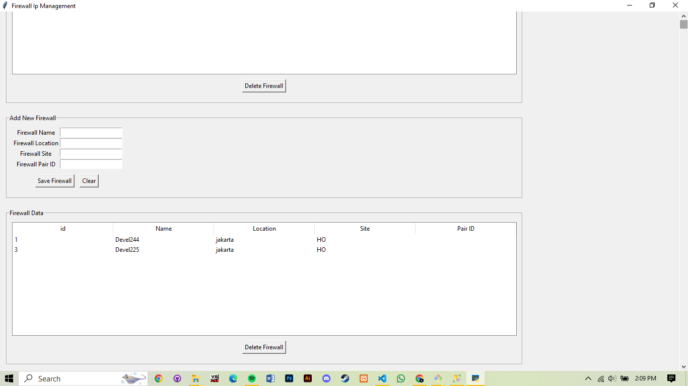
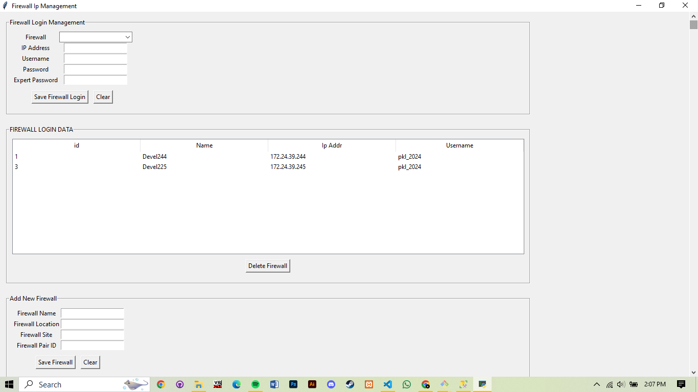

# Home-made Admin Panel For Firewall Data Retriever

## Overview

This application is designed to manage firewall data by inserting or deleting records in the database. It supports operations for both the master firewall table and the reference firewall login table.

## Features
- **Insert and delete rows** in the master firewall table.
- **Insert and delete rows** in the reference firewall login table.

## Images
- **Master Firewall Management**  
    
  *This image shows the interface for inserting and deleting rows in the master firewall table.*

- **Login Management**  
    
  *This image shows the interface for managing login data in the reference firewall login table.*

## Requirements
- Desktop PC
- Microsoft SQL Server (T-SQL)
- ODBC Driver 17 for SQL Server

## How to Run

### Presteps
1. Run the database migrations using the provided T-SQL script:  
   [db_migration.sql](https://github.com/Aikhusy/Checkpoint-Firewall-Data-Retriever/blob/main/db_migration.sql)  
   This script will create the necessary tables for the application.

### Steps
1. **Download and extract the compiled application:**  
   [Firewall Admin Panel](https://github.com/Aikhusy/Admin-Panel/blob/main/CompiledApps/Firewall%20Admin%20Panel.rar)

2. **Update the `config.json` file** with your database details. Here is an example configuration:
   ```json
   {
       "Driver": "ODBC Driver 17 for SQL Server",
       "Server": "YOUR-SERVER-NAME",
       "Database": "YOUR-DATABASE-NAME",
       "Trusted_Connection": "no",
       "UID": "your-username",
       "PWD": "your-password",
       "Encrypt": "no",
       "TrustServerCertificate": "no",
       "Encrypt_Phrase": "your-encrypt-phrase"
   }
